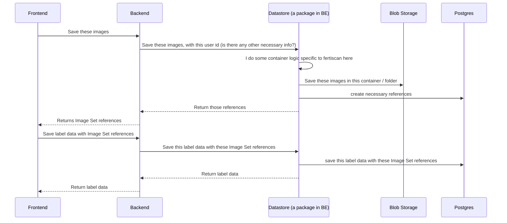

# diag

```mermaid
sequenceDiagram
    participant FE as Frontend
    participant BE as Backend
    participant Datastore as Datastore (a package in BE)
    participant Blob as Blob Storage
    participant DB as Postgres

    FE ->> BE: Save these images
    BE ->> Datastore: Save these images, with this user id (is there any other necessary info?)
    Datastore ->> Datastore: I do some container logic specific to fertiscan here
    Datastore ->> Blob: Save these images in this container / folder
    Datastore ->> DB: create necessary references
    Datastore -->> BE: Return those references
    BE -->> FE: Returns Image Set references

    FE ->> BE: Save label data with Image Set references
    BE ->> Datastore: Save this label data with these Image Set references 
    Datastore ->> DB: save this label data with these Image Set references
    Datastore -->> BE: Return label data
    BE -->> FE: Return label data
```
