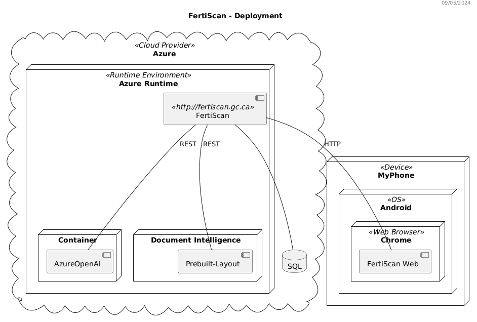

# Developer Documentation

## Document Analysis Workflow

The `/analyze` route serves to:

- **Upload and Process Documents**: Allows clients to upload
 images of documents for analysis.
- **Extract and Structure Data**: Utilizes Azure Document Intelligence to
 extract text and layout information from the uploaded documents.
- **Generate Forms**: Uses OpenAI's GPT-4 to generate a structured JSON
 form containing all the necessary information extracted from the document.
- **Provide Responses**: Returns the generated form to the client,
 facilitating the inspection and validation processes
 by providing all relevant data in a structured format.

In essence, the `/analyze` route automates the
 extraction and structuring of data from documents, significantly
 simplifying the workflow for
 users who need to process and analyze document content.

## Deployment

### FertiScan Web

- **Description**: The user interface of the application.
- **Repository**: <https://github.com/ai-cfia/fertiscan-frontend/>

### FertiScan Server

- **Description**: The core backend service of the FertiScan system.
- **Repository**: <https://github.com/ai-cfia/fertiscan-backend/>

### Database

- **Description**: The database where the
 information on fertiliser and labels is stored.
- **Repository**: <https://github.com/ai-cfia/nachet-datastore/>

## API Endpoints

### `POST /analyze`

Upload images for analysis and get the results as a JSON form.

### `POST /forms`

Create a new form and add it to the database.

### `PUT /forms`

Send the latest state of a form to the database.

### `DELETE /forms`

Remove all transient states of a form.

### `GET /forms`

Retrieve the latest state of a form from the database.

